# Data Flow Diagram - National Railway System

```mermaid
graph TB
    %% User Inputs
    subgraph "User Inputs"
        UI1[👤 User Registration/Login]
        UI2[🎫 Train Booking Request]
        UI3[💬 Support Messages]
        UI4[⭐ Ratings & Reviews]
        UI5[💰 Refund Requests]
        UI6[🤖 AI Chat Queries]
    end

    %% Frontend Layer
    subgraph "Frontend Layer (React)"
        FE[📱 React Application]
        FE1[🔐 Authentication Forms]
        FE2[🎫 Booking Interface]
        FE3[💬 Chatbot UI]
        FE4[📊 Dashboard Components]
        FE5[📝 Form Validation]
    end

    %% API Communication
    subgraph "API Communication"
        API[📡 Axios HTTP Requests]
        JWT[🔑 JWT Tokens]
        CORS[🌐 CORS Handling]
    end

    %% Backend Layer
    subgraph "Backend Layer (Node.js/Express)"
        BE[🚀 Express Server]
        BE1[🔐 Auth Middleware]
        BE2[📊 Business Logic]
        BE3[💳 Payment Processing]
        BE4[⏰ Background Jobs]
        BE5[📧 Email Notifications]
    end

    %% AI Service Layer
    subgraph "AI Service Layer (Python/FastAPI)"
        AI[🤖 FastAPI AI Service]
        AI1[🧠 Groq LLM API]
        AI2[🔍 Vector Search]
        AI3[💾 Conversation Memory]
        AI4[📚 Knowledge Base]
    end

    %% Database Layer
    subgraph "Database Layer (MSSQL)"
        DB[(💾 SQL Server Database)]
        DB1[👥 Clients Table]
        DB2[🚂 Schedule Table]
        DB3[🎫 Bookings Table]
        DB4[💬 Conversations Table]
        DB5[⭐ Ratings Table]
        DB6[🏆 LoyaltyRewards Table]
    end

    %% Data Flow Connections
    UI1 --> FE1
    UI2 --> FE2
    UI3 --> FE4
    UI4 --> FE4
    UI5 --> FE4
    UI6 --> FE3

    FE --> API
    API --> BE
    BE --> AI
    AI --> BE

    BE --> DB
    AI --> DB

    %% Database Relationships
    DB1 -.-> DB3
    DB1 -.-> DB4
    DB1 -.-> DB5
    DB1 -.-> DB6
    DB2 -.-> DB3
    DB3 -.-> DB6

    %% Response Flow (Reverse)
    DB --> BE
    BE --> API
    API --> FE
    FE --> UI1
    FE --> UI2
    FE --> UI3
    FE --> UI4
    FE --> UI5
    FE --> UI6

    %% Styling
    classDef userInput fill:#e1f5fe,stroke:#01579b,stroke-width:2px
    classDef frontend fill:#f3e5f5,stroke:#4a148c,stroke-width:2px
    classDef backend fill:#e8f5e8,stroke:#1b5e20,stroke-width:2px
    classDef ai fill:#fff3e0,stroke:#e65100,stroke-width:2px
    classDef database fill:#fce4ec,stroke:#880e4f,stroke-width:2px
    classDef api fill:#f9fbe7,stroke:#827717,stroke-width:2px

    class UI1,UI2,UI3,UI4,UI5,UI6 userInput
    class FE,FE1,FE2,FE3,FE4,FE5 frontend
    class API,JWT,CORS api
    class BE,BE1,BE2,BE3,BE4,BE5 backend
    class AI,AI1,AI2,AI3,AI4 ai
    class DB,DB1,DB2,DB3,DB4,DB5,DB6 database
```



## Data Flow Explanation

### 1. **Input Sources** 📥
- **User Actions**: Registration, booking, messaging, ratings, refunds
- **AI Queries**: Chatbot conversations and support requests
- **Admin Actions**: Schedule management, refund approvals

### 2. **Frontend Processing** 🖥️
- **React Components**: Capture user inputs and form data
- **Validation**: Client-side form validation and error handling
- **API Calls**: Axios requests with JWT authentication
- **State Management**: Real-time UI updates and loading states

### 3. **Backend Processing** ⚙️
- **Authentication**: JWT token verification and user authorization
- **Business Logic**: Booking validation, payment processing, refund calculations
- **Data Transformation**: Converting API requests to database operations
- **Background Jobs**: Payment expiry monitoring, automated cancellations

### 4. **AI Processing** 🤖 (Parallel Flow)
- **Query Analysis**: Natural language processing of user messages
- **Vector Search**: Semantic similarity matching in knowledge base
- **LLM Generation**: Context-aware response generation using Groq API
- **Memory Management**: Conversation history and context preservation

### 5. **Database Operations** 💾
- **CRUD Operations**: Create, Read, Update, Delete on all entities
- **Transactions**: Atomic operations for booking and payment flows
- **Triggers**: Automatic loyalty points, conversation archiving, tier updates
- **Stored Procedures**: Complex business logic (booking, refunds, scheduling)

### 6. **Response Flow** 📤 (Reverse Direction)
- **Database → Backend**: Query results and confirmation messages
- **Backend → Frontend**: JSON responses with success/error status
- **Frontend → User**: UI updates, notifications, and data display

## Key Data Flow Patterns

### **Booking Flow** 🎫
```
User Input → Frontend Validation → API Call → Backend Logic → Database Transaction → Payment Processing → Confirmation Response
```

### **AI Chat Flow** 🤖
```
User Message → Frontend Chat UI → API Proxy → AI Service → Vector Search → LLM Response → Database Logging → Response Display
```

### **Authentication Flow** 🔐
```
Login Form → Frontend Validation → API Call → Backend Verification → Database Query → JWT Generation → Token Storage → Protected Access
```

### **Admin Operations Flow** 👑
```
Admin Action → Frontend Forms → API Call → Backend Authorization → Database CRUD → Audit Logging → Success Confirmation
```

## Data Storage & Retrieval

### **Primary Data Entities**
- **Users**: Authentication, profiles, preferences
- **Schedules**: Train routes, timings, pricing, availability
- **Bookings**: Reservations, payments, status tracking
- **Conversations**: Support messages, AI interactions
- **Analytics**: Ratings, loyalty points, usage metrics

### **Data Relationships**
- **One-to-Many**: Users → Bookings, Schedules → Bookings
- **Many-to-Many**: Users ↔ Conversations (support threads)
- **Hierarchical**: Stations → Schedules → Trains

### **Data Integrity**
- **Constraints**: Foreign keys, unique indexes, check constraints
- **Triggers**: Automatic calculations, audit trails, cleanup operations
- **Transactions**: Atomic operations preventing data inconsistency

## Performance Considerations

### **Query Optimization**
- **Indexes**: Strategic indexing on frequently queried columns
- **Views**: Pre-computed aggregations for dashboard displays
- **Caching**: Browser storage for session data and API responses

### **Scalability Features**
- **Connection Pooling**: Efficient database connection management
- **Background Processing**: Non-blocking operations for heavy tasks
- **Pagination**: Large dataset handling for listings and searches

### **Monitoring & Logging**
- **API Metrics**: Response times, error rates, usage patterns
- **Database Performance**: Query execution plans and bottlenecks
- **User Analytics**: Interaction tracking and behavior analysis